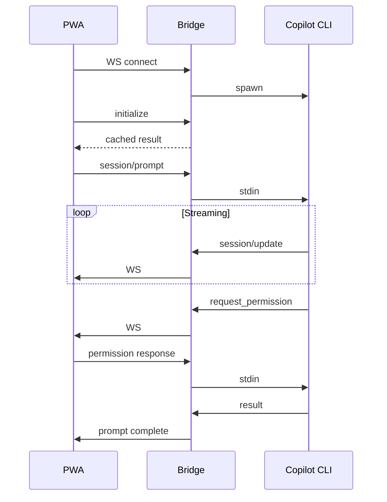

# Architecture

Technical documentation for copilot-uplink's internal architecture.

## Overview

copilot-uplink connects three components in a pipeline:

```
┌──────────────┐       WebSocket        ┌──────────────┐       stdio/NDJSON      ┌──────────────┐
│  PWA Client  │◄─────────────────────►│ Bridge Server │◄──────────────────────►│  Copilot CLI  │
│  (browser)   │       (JSON-RPC)       │  (Node.js)   │    (child process)     │  (--acp)      │
└──────────────┘                        └──────────────┘                        └──────────────┘
```

| Component | Technology | Role |
|-----------|------------|------|
| **PWA Client** | Preact SPA | Drives ACP protocol, renders chat UI with streaming, tool calls, permissions |
| **Bridge Server** | Express + WebSocket | Spawns CLI, bridges WebSocket ↔ stdio, caches state for reconnection |
| **Copilot CLI** | `copilot --acp --stdio` | GitHub's CLI in ACP mode (`--acp` enables the Agent Client Protocol for programmatic control), speaks JSON-RPC 2.0 over NDJSON |

## Key Source Files

| Path | Purpose |
|------|---------|
| `bin/cli.ts` | CLI entry point, orchestrates startup and tunnels |
| `src/server/index.ts` | Express server, WebSocket handling, API endpoints |
| `src/server/bridge.ts` | Spawns and manages the Copilot CLI process |
| `src/server/tunnel.ts` | Dev Tunnel CLI wrappers |
| `src/server/resolve-port.ts` | Port resolution logic for tunnel modes |
| `src/client/app.tsx` | Root Preact component |
| `src/client/acp-client.ts` | ACP protocol client (WebSocket, JSON-RPC) |
| `src/client/conversation.ts` | Conversation state management |
| `src/client/slash-commands.ts` | Command parsing and completion |

## The Bridge

The bridge is intentionally a "dumb pipe" — it forwards NDJSON lines between the WebSocket and the CLI's stdin/stdout without parsing ACP semantics.

**Benefits:**
- Simple (~100 lines of core logic)
- Testable without ACP knowledge
- Protocol changes only affect the PWA

**Selective interceptions:**

| Message | Why Intercepted |
|---------|-----------------|
| `initialize` request | Cached for instant reconnects |
| `session/new` response | Tracked for session listing |
| `session/load` request | Replayed from buffer when already active |
| `uplink/shell` | Shell command execution (server-side) |
| `uplink/rename_session` | Direct YAML file write |
| `uplink/clear_history` | Buffer management |

## Lifecycle

### Cold Start

```
1. Bridge spawns `copilot --acp --stdio`
2. Immediately sends `initialize` (before client connects)
3. Caches the response
4. Client connects → returns cached init (0ms wait)
```

This "eager init" overlaps CLI cold start (~10-30s) with user actions (scanning QR, opening browser).

### Reconnection

The bridge survives client disconnects:

```
1. Client disconnects → bridge stays alive
2. Client reconnects → new WebSocket, same bridge
3. `initialize` → served from cache
4. `session/load` → replayed from server buffer
```

No cold start on page refresh or mobile resume.

## Dev Tunnels

Two modes with different ownership semantics:

### Auto-Persistent (`--tunnel`)

copilot-uplink owns the tunnel. Creates `uplink-<hash>` from cwd, manages port config.

```bash
npx @denifia/copilot-uplink@latest --tunnel
```

### User-Managed (`--tunnel-id`)

User owns the tunnel. copilot-uplink reads but never modifies it.

```bash
devtunnel create my-tunnel
devtunnel port create my-tunnel -p 8080
npx @denifia/copilot-uplink@latest --tunnel-id my-tunnel
```

## Session Management

Sessions are stored by the CLI at `~/.copilot/session-state/{uuid}/`:

```
workspace.yaml    # Metadata (id, cwd, summary, timestamps)
events.jsonl      # Full conversation log
checkpoints/      # Agent checkpoints
files/            # Session artifacts
```

### Hybrid Session Listing

The CLI's `session/list` doesn't refresh after startup, so copilot-uplink supplements:

1. **CLI `session/list`** — historical sessions
2. **In-memory map** — sessions created this bridge lifetime

Merged and deduped by `/api/sessions`.

### Session Resume

When the same session is already loaded, `session/load` errors. The server intercepts this and replays from its in-memory buffer instead, providing seamless reconnection.

## ACP Protocol

Key message types:

| Method | Direction | Purpose |
|--------|-----------|---------|
| `initialize` | Client → Agent | Capability negotiation |
| `session/new` | Client → Agent | Create session |
| `session/load` | Client → Agent | Load existing session |
| `session/prompt` | Client → Agent | Send user prompt |
| `session/update` | Agent → Client | Streaming responses |
| `session/request_permission` | Agent → Client | Permission prompts |
| `session/cancel` | Client → Agent | Cancel in-progress prompt |

## Logging

Uses the [`debug`](https://www.npmjs.com/package/debug) package:

```bash
# All logs
DEBUG=copilot-uplink:* npx @denifia/copilot-uplink@latest

# Or via CLI
npx @denifia/copilot-uplink@latest --verbose
```

**Namespaces:** `server`, `bridge`, `session`, `timing`

## Debug Telemetry

Both client and server maintain ring buffers (5,000 entries) capturing:

- Connection state transitions
- All JSON-RPC messages
- UI mutations

Export via `/debug` command → downloads `uplink-debug-{timestamp}.json`.

Analyze with:
```bash
npx tsx bin/debug-viewer.ts uplink-debug-*.json timeline
```

## Message Flow


