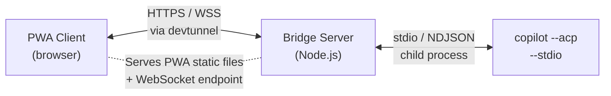

#  Copilot Uplink

> **TL;DR:** Control GitHub Copilot CLI from your phone. copilot-uplink is a mobile-friendly PWA that connects to the Copilot CLI running on your machine, giving you a chat interface to Copilot from anywhere — even lying on the couch with your phone while your computer does the coding.

[](https://github.com/denifia/copilot-uplink/actions)
[](https://www.npmjs.com/package/@denifia/copilot-uplink)
[](LICENSE)

> **Credit:** This project is a fork of [MattKotsenas/uplink](https://github.com/MattKotsenas/uplink), who did all the heavy lifting building the original concept. I've added some features to suit my workflow — see the [features](#features) section.

<p align="center">
  
</p>

## Installation & Usage

### Prerequisites

- **Node.js 22.14+**
- **GitHub Copilot CLI** installed and authenticated

### Quick Start

```bash
# Navigate to your project
cd ~/your/project/

# Start copilot-uplink with remote access
npx @denifia/copilot-uplink@latest --tunnel
```

That's it! A QR code will appear in your terminal — scan it with your phone to open the chat interface.

### Setting Up Dev Tunnels (Required for Remote Access)

To access copilot-uplink from your phone or any device outside your local network, you need Microsoft Dev Tunnels.

**Install Dev Tunnels:**

| Platform | Command |
|----------|---------|
| macOS | `brew install --cask devtunnel` |
| Linux | `curl -sL https://aka.ms/DevTunnelCliInstall \| bash` |
| Windows | `winget install Microsoft.devtunnel` |

**Authenticate once:**

```bash
devtunnel user login
```

### Getting the App on Your Phone

1. **Start copilot-uplink with `--tunnel`** and wait for startup to complete
2. **Scan the tunnel QR code** — your terminal shows two QR codes: one for local network, one for the tunnel
3. **Add to home screen** — your browser will prompt you to install the PWA

The tunnel URL is **stable per project** — copilot-uplink generates a deterministic tunnel name from your working directory. Reinstalling or restarting always uses the same URL, so your home screen shortcut keeps working.

## Features

- 💬 **Chat interface** with streaming responses
- 🔧 **Tool call visibility** — see file reads, edits, terminal commands, and more with icons and status
- 🔐 **Permission prompts** — approve or deny tool actions with tap buttons
- 📋 **Plan tracking** — view agent plans with priorities and completion status
- 📱 **PWA** — installable on your phone's home screen, works offline (cached shell)
- 🌐 **Remote access** via Microsoft Dev Tunnels
- 🔄 **Auto-reconnect** with exponential backoff (1s → 30s max)
- 🌙 **Dark/light/auto theme**
- 🤖 **Agent modes** — `/agent`, `/plan`, and `/autopilot` for different workflows
- 🚀 **YOLO mode** — auto-approve all permissions when you trust the task

## CLI Reference

```bash
npx @denifia/copilot-uplink@latest [options]
# or if installed globally:
copilot-uplink [options]
```

| Flag | Description | Default |
|------|-------------|---------|
| `--port <n>` | Port for the bridge server | random |
| `--tunnel` | Start a devtunnel for remote access | off |
| `--no-tunnel` | Explicitly disable tunnel | — |
| `--tunnel-id <name>` | Use a pre-created devtunnel (reads its port) | — |
| `--allow-anonymous` | Allow anonymous tunnel access (no GitHub auth) | off |
| `--cwd <path>` | Working directory for Copilot | current dir |
| `--verbose` | Enable debug logging | off |
| `--help` | Show help | — |

### Using Your Own Tunnel

If you want explicit control over the tunnel name (e.g., to share across machines):

```bash
# One-time setup
devtunnel create my-tunnel
devtunnel port create my-tunnel -p 8080

# Every session
npx @denifia/copilot-uplink@latest --tunnel-id my-tunnel
```

## In-App Commands

Type `/` in the prompt to see all commands:

| Command | Description |
|---------|-------------|
| `/model <name>` | Switch AI model |
| `/agent` | Default agent mode |
| `/plan` | Plan mode — Copilot plans before executing |
| `/autopilot` | Autonomous mode — auto-continues until done |
| `/theme <dark\|light\|auto>` | Set color theme |
| `/yolo <on\|off>` | Auto-approve all permission requests |
| `/session <list\|rename>` | Manage sessions |
| `/clear` | Clear conversation history |
| `/debug` | Download a debug log |

## How It Works



1. **Copilot CLI** runs locally in ACP mode, speaking JSON-RPC over stdin/stdout
2. **Bridge server** spawns the CLI and bridges WebSocket ↔ stdin/stdout
3. **PWA** connects over WebSocket and renders the chat interface
4. **Dev Tunnel** (optional) exposes everything over HTTPS for remote access

See [ARCHITECTURE.md](ARCHITECTURE.md) for the full technical deep-dive.

## Limitations

- **Single active input** — multiple clients can connect, but the app expects user input from one at a time
- **No file/terminal proxying** — the PWA doesn't provide file system or terminal access back to the agent
- **Auth via devtunnel only** — no custom authentication layer

## Contributing

See [CONTRIBUTING.md](CONTRIBUTING.md) for development setup, testing, and release instructions.

## License

MIT — see [LICENSE](LICENSE)
